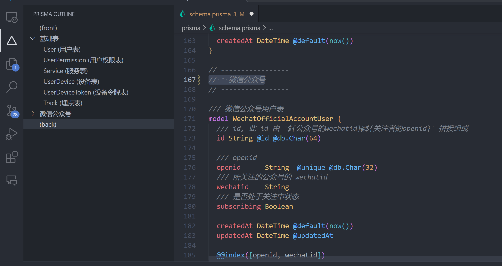

# Code Outline

In your code, define an outline using comments and freely navigate within the outline! Support .vue, .prisma, .md, .ts, .js ...

[General](#General) | [Vue](#Vue) | [Prisma](#Prisma) | [Markdown](#Markdown) | [Typescript](#Typescript) | [Javascript](#Typescript)

I always encounter scenarios where I need to write a lot of logic in a single file, often consisting of hundreds or thousands of lines of code. Yes! I'm talking about you! [Vue](https://vuejs.org/) and [Prisma](https://www.prisma.io/)!

Long code can force me to jump back and forth between files. To alleviate this issue, I developed this [VSCode extension](https://marketplace.visualstudio.com/items?itemName=akirarika.prisma-outline). You can create an "outline" in your code using comments, and then you can easily navigate to the vicinity of your outline using the sidebar in your VSCode. In addition to defining the outline through comments, I also attempted to summarize your code. Some key points in the code will be automatically summarized as sub-levels in your outline. It was initially designed for Prisma but now supports more languages.



## General

For any document, the following two forms of comments will be considered as an outline. You can use the outline to quickly navigate within the document.

```ts
// * Your Outline
```

```ts
/**
 * -- Your Outline
 */
```

```html
<!-- Your Outline -->
```

## Vue

In addition to declaring an outline in the [General](#General) section, the `<template>`, `<script>`, and `<style>` sections in a `.vue` file are also considered as outlines.

These contents will be automatically annotated and treated as subsets of the outline.

- `defineProps`, `defineEmits`, `ref`, `reactive`, `const`, `function`

## Prisma

> Note: If you're looking for a way to split the `schema.prisma` file, you can try using [prisma-import](https://github.com/ajmnz/prisma-import). I highly recommend it.

You can add an outline by adding a comment starting with an asterisk (\*). You must have at least one outline for me to work, like this:

```ts
// * Your Outline
```

Although it is sufficient to do so, writing it like this may be more aesthetically pleasing:

```ts
// -----------------
// -- Your Outline
// -----------------
```

All models will be automatically labeled and included as subsets of the outline. If the preceding line of a model is a comment in the form of `///`, the model's name will additionally include the content of that comment.

Try pasting the following code into your `schema.prisma` file and see the effect, are you ready?

```ts
generator client {
  provider = "prisma-client-js"
}

datasource db {
  provider     = "mysql"
  relationMode = "prisma"
  url          = env("DATABASE_URL")
}

// -----------------
// * User and Permissions
// -----------------

/// User Table
model user {
  id             Int           @id
  name           String?
  email          String?
  updatedAt      DateTime         @updatedAt
  createdAt      DateTime         @default(now())
  UserPermission userPermission[]
}

/// User Permission Table
model userPermission {
  id        Int    @id
  name      String
  expiredAt DateTime?
  userId    Int
  updatedAt DateTime  @updatedAt
  createdAt DateTime  @default(now())
}

// -----------------
// * Articles
// -----------------

/// Article Table
model article {
  id        Int   @id
  title     String
  content   String
  userId    Int
  createdAt DateTime @default(now())
  updatedAt DateTime @updatedAt
}

/// Comment Table
model comment {
  id        Int   @id
  content   String
  articleId Int
  createdAt DateTime @default(now())
  updatedAt DateTime @updatedAt
}

// -----------------
// * Others
// -----------------

// TODO

```

## Markdown

In addition to the way outlines are declared in [General](#General), the `#` and `##` symbols in `.md` files are also considered as headings.

However, `###` is treated as a subset of the outline and displayed accordingly.

## Typescript

For Typescript and Javascript, all top-level variables and methods are considered subsets of the outline.
